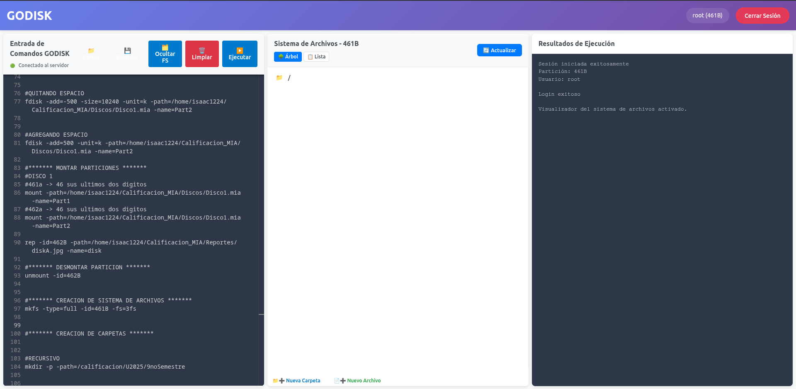
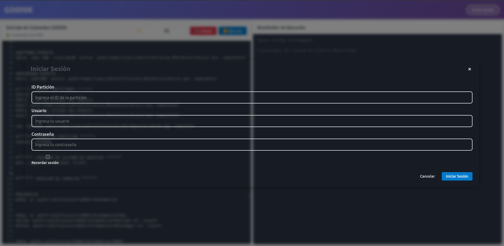
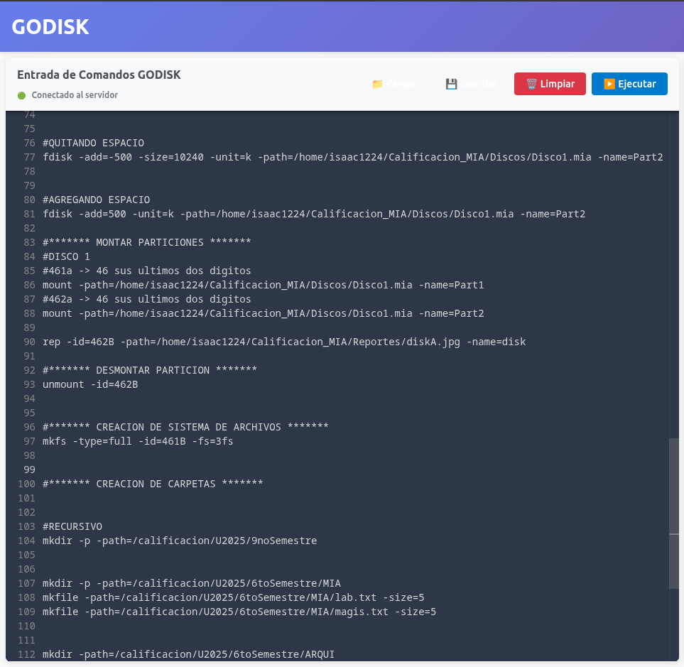
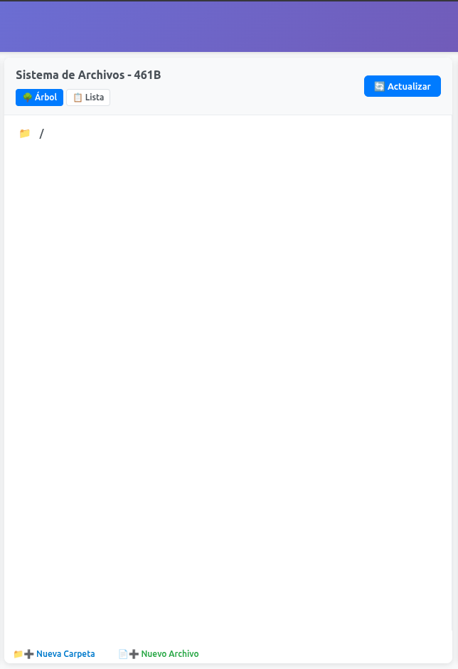
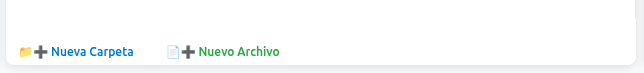
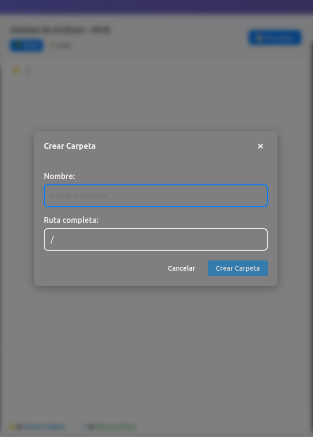
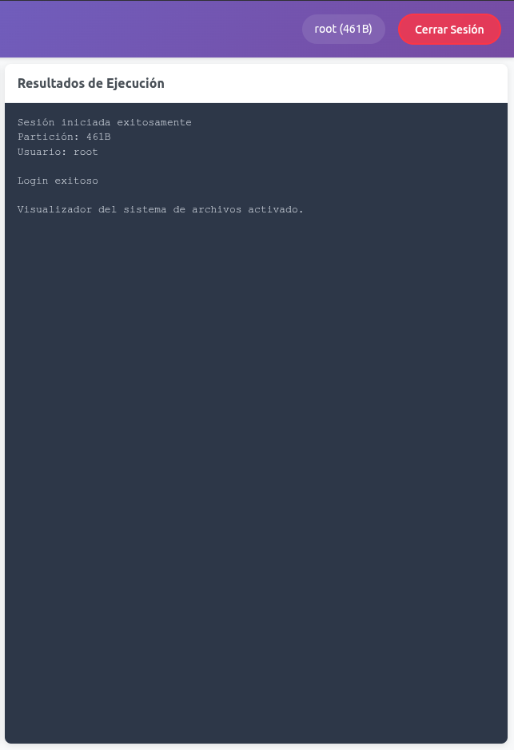

# Manual de Usuario - Sistema de Gestión de Discos (GODISK)

## Introducción

GODISK es una aplicación web que permite gestionar discos virtuales, particiones, sistemas de archivos y usuarios de manera intuitiva. Este manual te guiará a través de todas las funcionalidades disponibles en la interfaz web.

## Requisitos del Sistema

### Navegador Web
- Chrome 90+ (recomendado)
- Firefox 88+
- Safari 14+
- Edge 90+

### Resolución de Pantalla
- Mínimo: 1024x768
- Recomendado: 1920x1080 o superior

## Acceso al Sistema

### URL de Acceso
```
http://localhost:5173  (desarrollo)
http://tu-dominio.com  (producción)
```

### Pantalla Principal
Al acceder al sistema, verás la interfaz principal dividida en varias secciones:

1. **Barra Superior**: Información del usuario y botón de cerrar sesión
2. **Panel Izquierdo**: Editor de comandos y botones de acción
3. **Panel Central**: Visualizador del sistema de archivos
4. **Panel Derecho**: Resultados de ejecución y detalles



## Autenticación

### Inicio de Sesión

Para utilizar el sistema, primero debes iniciar sesión:

1. Haz clic en el botón **"Iniciar Sesión"** en la barra superior
2. Completa el formulario de login:
   - **Usuario**: Nombre de usuario (ej: root)
   - **Contraseña**: Contraseña del usuario (ej: 123)
   - **ID Partición**: ID de la partición montada (ej: 461A)
3. Haz clic en **"Iniciar Sesión"**



### Estados de Sesión

- **No logueado**: Funcionalidades limitadas, solo comandos de disco
- **Logueado**: Acceso completo a todas las funcionalidades
- **Sesión expirada**: El sistema te pedirá volver a autenticarte

### Cerrar Sesión

Para cerrar sesión, haz clic en el botón **"Cerrar Sesión"** en la barra superior.

## Editor de Comandos

### Interfaz del Editor

El editor principal utiliza Monaco Editor y proporciona:

- **Syntax highlighting**: Resaltado de sintaxis para comandos
- **Autocompletado**: Sugerencias de comandos y parámetros
- **Numeración de líneas**: Para fácil referencia
- **Múltiples líneas**: Ejecuta varios comandos a la vez



### Botones de Acción

#### Limpiar (🧹)
- **Función**: Limpia el contenido del editor
- **Uso**: Haz clic para empezar con un editor vacío

#### Ejecutar (▶️)
- **Función**: Ejecuta los comandos escritos en el editor
- **Resultado**: Los resultados aparecen en el panel derecho
- **Múltiples comandos**: Ejecuta línea por línea

### Escribir Comandos

Los comandos siguen la sintaxis: `comando -parametro=valor`

Ejemplos:
```
mkdisk -size=5 -unit=M -path=/disco.mia
fdisk -size=1024 -path=/disco.mia -name=Part1 -unit=K -type=P -add
mount -path=/disco.mia -name=Part1
```

## Gestión de Discos

### Crear Disco Virtual

Para crear un nuevo disco virtual:

1. Escribe el comando en el editor:
```
mkdisk -size=5 -unit=M -path=/ruta/disco.mia -fit=FF
```

2. Parámetros:
   - **-size**: Tamaño del disco
   - **-unit**: Unidad (B, K, M)
   - **-path**: Ruta donde crear el disco
   - **-fit**: Algoritmo de ajuste (FF, BF, WF)

3. Haz clic en **Ejecutar**

*[Insertar captura de pantalla de creación de disco]*

### Eliminar Disco

```
rmdisk -path=/ruta/disco.mia
```

El sistema pedirá confirmación antes de eliminar el disco.

## Gestión de Particiones

### Crear Partición

Para crear una nueva partición:

```
fdisk -size=1024 -path=/disco.mia -name=Particion1 -unit=K -type=P -fit=BF -add
```

Parámetros:
- **-size**: Tamaño de la partición
- **-path**: Ruta del disco
- **-name**: Nombre de la partición
- **-unit**: Unidad de medida
- **-type**: Tipo (P=Primaria, E=Extendida, L=Lógica)
- **-fit**: Algoritmo de ajuste
- **-add**: Acción de agregar


### Eliminar Partición

```
fdisk -path=/disco.mia -name=Particion1 -delete
```

### Montar Partición

Antes de usar una partición, debe montarse:

```
mount -path=/disco.mia -name=Particion1
```

El sistema asignará automáticamente un ID único (ej: 461A).

### Crear Sistema de Archivos

```
mkfs -type=full -id=461A -fs=3fs
```

Parámetros:
- **-type**: Tipo de formato (full, fast)
- **-id**: ID de la partición montada
- **-fs**: Sistema de archivos (2fs=ext2, 3fs=ext3)

## Sistema de Archivos

### Visualizador de Archivos

Una vez logueado, el panel central muestra el árbol de directorios:

- **Carpetas**: Icono 📁, expandible/colapsable
- **Archivos**: Icono 📄, seleccionables
- **Navegación**: Clic para navegar por la estructura



### Detalles del Elemento

Al seleccionar un archivo o carpeta, el panel derecho muestra:

- **Nombre**: Nombre del elemento
- **Ruta**: Ruta completa
- **Tipo**: Archivo o directorio
- **Permisos**: Permisos del elemento
- **Propietario**: Usuario propietario
- **Grupo**: Grupo propietario
- **Modificado**: Fecha de última modificación

### Gestión de Archivos y Carpetas

#### Botones de Acción Rápida

En el sistema de archivos, encontrarás botones para:

**📁➕ Nueva Carpeta**
- Abre un modal para crear una nueva carpeta
- Solicita nombre y ubicación
- Valida nombres permitidos

**📄➕ Nuevo Archivo**
- Abre un modal para crear un nuevo archivo
- Solicita nombre, tamaño y contenido inicial
- Configura permisos automáticamente



#### Modal de Creación

Los modales de creación incluyen:

1. **Campo Nombre**: Introduce el nombre del elemento
2. **Ruta Completa**: Se muestra automáticamente
3. **Tamaño** (solo archivos): Especifica en bytes
4. **Contenido** (solo archivos): Contenido inicial opcional
5. **Botones**: Crear o Cancelar



### Comandos de Archivos

#### Crear Directorio

```
mkdir -path=/ruta/nueva/carpeta
mkdir -path=/ruta/nueva/carpeta -p  # Crear padres si no existen
```

#### Crear Archivo

```
mkfile -path=/archivo.txt -size=100
mkfile -path=/archivo.txt -size=100 -cont="contenido del archivo"
```

#### Mostrar Contenido

```
cat -file=/ruta/archivo.txt
```

#### Eliminar Elementos

```
remove -path=/archivo.txt
remove -path=/carpeta/
```

#### Renombrar

```
rename -path=/archivo.txt -name=nuevo_nombre.txt
```

#### Buscar

```
find -path=/directorio -name=archivo.txt
```

## Gestión de Usuarios

### Crear Usuario

```
mkusr -user=nombreusuario -pass=contraseña -grp=grupo
```

### Eliminar Usuario

```
rmusr -user=nombreusuario
```

### Crear Grupo

```
mkgrp -name=nombregrupo
```

### Eliminar Grupo

```
rmgrp -name=nombregrupo
```

### Cambiar Grupo

```
chgrp -user=usuario -grp=nuevogrupo
```

## Reportes

### Generar Reportes

El sistema puede generar diversos tipos de reportes:

```
rep -id=461A -path=/reporte.jpg -name=tipo_reporte
```

### Tipos de Reportes Disponibles

1. **mbr**: Reporte del Master Boot Record
   ```
   rep -id=461A -path=/mbr_report.jpg -name=mbr
   ```

2. **disk**: Reporte del estado del disco
   ```
   rep -id=461A -path=/disk_report.jpg -name=disk
   ```

3. **tree**: Árbol de directorios
   ```
   rep -id=461A -path=/tree_report.jpg -name=tree
   ```

4. **sb**: Reporte del superbloque
   ```
   rep -id=461A -path=/sb_report.jpg -name=sb
   ```

5. **inode**: Reporte de inodos
   ```
   rep -id=461A -path=/inode_report.jpg -name=inode
   ```

6. **block**: Reporte de bloques
   ```
   rep -id=461A -path=/block_report.jpg -name=block
   ```

7. **bm_inode**: Bitmap de inodos
   ```
   rep -id=461A -path=/bm_inode.jpg -name=bm_inode
   ```

8. **bm_block**: Bitmap de bloques
   ```
   rep -id=461A -path=/bm_block.jpg -name=bm_block
   ```

## Panel de Resultados

### Interpretación de Resultados

El panel derecho muestra los resultados de los comandos ejecutados:

- **✅ Éxito**: Comandos ejecutados correctamente
- **❌ Error**: Comandos con errores, descripción detallada
- **ℹ️ Información**: Datos adicionales del sistema

### Tipos de Mensajes

1. **Confirmación**: "Disco creado exitosamente"
2. **Error**: "Error: Partición no encontrada"
3. **Advertencia**: "Advertencia: El archivo ya existe"
4. **Información**: "Partición montada con ID: 461A"



## Casos de Uso Comunes

### Configuración Inicial Completa

1. **Crear disco**:
   ```
   mkdisk -size=10 -unit=M -path=/mi_disco.mia
   ```

2. **Crear partición**:
   ```
   fdisk -size=5120 -path=/mi_disco.mia -name=Particion1 -unit=K -type=P -add
   ```

3. **Montar partición**:
   ```
   mount -path=/mi_disco.mia -name=Particion1
   ```

4. **Crear sistema de archivos**:
   ```
   mkfs -type=full -id=461A -fs=3fs
   ```

5. **Iniciar sesión**:
   ```
   login -user=root -pass=123 -id=461A
   ```

### Gestión Básica de Archivos

1. **Crear estructura de directorios**:
   ```
   mkdir -path=/documentos
   mkdir -path=/documentos/proyectos -p
   mkdir -path=/documentos/imagenes
   ```

2. **Crear archivos**:
   ```
   mkfile -path=/documentos/readme.txt -size=100 -cont="Archivo de documentación"
   mkfile -path=/documentos/proyectos/proyecto1.txt -size=200
   ```

3. **Verificar contenido**:
   ```
   cat -file=/documentos/readme.txt
   ```

### Administración de Usuarios

1. **Crear grupos**:
   ```
   mkgrp -name=desarrolladores
   mkgrp -name=usuarios
   ```

2. **Crear usuarios**:
   ```
   mkusr -user=juan -pass=secreto -grp=desarrolladores
   mkusr -user=maria -pass=clave123 -grp=usuarios
   ```

3. **Cambiar permisos**:
   ```
   chgrp -user=juan -grp=usuarios
   ```

## Solución de Problemas

### Problemas Comunes

#### Error: "Partición no montada"
**Problema**: Intentas acceder a archivos sin montar la partición
**Solución**: 
1. Verificar particiones disponibles
2. Montar la partición correcta
3. Usar el ID correcto en el login

#### Error: "Usuario no autenticado"
**Problema**: Comandos de archivos sin login
**Solución**: 
1. Hacer login primero
2. Verificar credenciales
3. Usar ID de partición correcta

#### Error: "Archivo no encontrado"
**Problema**: Ruta incorrecta o archivo inexistente
**Solución**: 
1. Verificar la ruta completa
2. Usar el visualizador para navegar
3. Crear directorios padre si es necesario

### Consejos de Uso

1. **Rutas**: Siempre usa rutas absolutas que empiecen con `/`
2. **Nombres**: Evita espacios y caracteres especiales
3. **Tamaños**: Especifica unidades claramente (B, K, M)
4. **Backup**: Genera reportes periódicamente
5. **Organización**: Crea una estructura de directorios lógica

## Limitaciones del Sistema

### Tamaños Máximos
- **Disco**: Limitado por espacio disponible
- **Partición**: No puede exceder el tamaño del disco
- **Archivo**: Limitado por el sistema de archivos

### Nombres Permitidos
- **Longitud**: Máximo 16 caracteres para particiones
- **Caracteres**: Alfanuméricos, guiones y puntos
- **Restricciones**: No espacios en nombres de particiones

### Concurrencia
- **Sesión única**: Solo un usuario logueado a la vez por partición
- **Operaciones**: Los comandos se ejecutan secuencialmente

## Shortcuts y Atajos

### Teclado
- **Ctrl + Enter**: Ejecutar comandos del editor
- **Ctrl + L**: Limpiar editor
- **Esc**: Cerrar modales

### Ratón
- **Doble clic**: Expandir/colapsar carpetas
- **Clic derecho**: Menú contextual (futuro)
- **Arrastrar**: Redimensionar paneles

## Actualizaciones y Mantenimiento

### Actualizar Datos
El botón **"Actualizar"** en el sistema de archivos refresca:
- Estructura de directorios
- Estado de archivos
- Información de metadatos

## Contacto y Soporte

Para problemas técnicos o consultas sobre el uso del sistema, consulta:
- Manual técnico para desarrolladores
- Documentación del código fuente
- Logs del sistema para diagnóstico detallado
